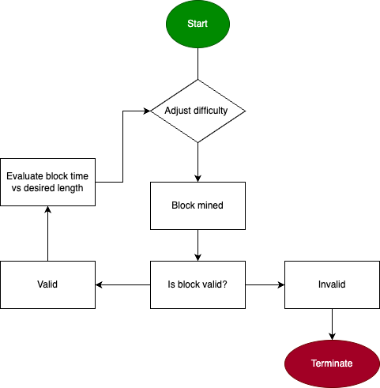

Crabchain, a crustacean themed blockchain implementation written in Rust.

## Table of Contents

- [Introduction](#introduction)
- [Features](#features)
- [Flowchart](#flowchart)
- [Block Difficulty Explained](#block-difficulty-explained)
- [Installation](#installation)
- [Usage](#usage)
- [Contributing](#contributing)
- [License](#license)

## Introduction

I built Crabchain as a way to familiarize myself with Rust. Crabchain doesn't have too many features, but it is fairly nimble and has a distinct crustacean flavor. It does allow for some of the most common blockchain operations such as mining with proof of work, viewing, and validating the blockchain. It also allows you to set the difficulty level to tune it for your needs.

## Features

- **Mine new blocks**: Crabchain allows you to mine new blocks and add them to the blockchain using a proof-of-work algorithm.
- **Set difficulty levels**: You can set the difficulty level of the blockchain to control the mining process.
- **View the blockchain**: Crabchain provides a way to view the blockchain and its transactions.
- **Blockchain validation**: Crabchain can validate the integrity of the blockchain and ensure that it follows the rules of the protocol.
- **Basic data structure**: Crabchain uses a basic blockchain data structure to store blocks and transactions.

## Flowchart

## Block Difficulty Explained

The difficulty setting is the number of leading zeros we ask the miner to submit for a valid proof of work. The higher the difficulty, the harder it is to mine a new block.

The formula for calculating the probability of finding a hash with `x` difficulty is:

$P(x) = (1/16)^x$

while the average attempts to find a hash with `x` difficulty is the inverse of the probability:

$N(x) = (1/P(x)) = 16^x$

So, the average number of attempts for each difficulty can be tabulated as follows:

- For difficulty 1: $N(1) = 16^1 = 16$
- For difficulty 2: $N(2) = 16^2 = 256$
- For difficulty 3: $N(3) = 16^3 = 4096$
- For difficulty 4: $N(4) = 16^4 = 65536$
- For difficulty 5: $N(5) = 16^5 = 1048576$
- For difficulty 6: $N(6) = 16^6 = 16777216$
- For difficulty 7: $N(7) = 16^7 = 268435456$
- For difficulty 8: $N(8) = 16^8 = 4294967296$
- For difficulty ... 52: $N(52) = 16^52 = 4503599627370496$

## Installation

To install Crabchain, follow these steps:

1. Clone the repository: `git clone https://github.com/your-username/crabchain.git`
2. Navigate to the project directory: `cd crabchain`
3. Build the project: `cargo build --release`
4. Run the executable: `cargo run`

## Usage

To use Crabchain, follow these steps:

1. Run the executable: `target/release/crabchain`
2. Select an option from the menu:
   - `1` - Mine a new block
   - `2` - Set difficulty level
   - `3` - View the blockchain
   - `4` - Validate the blockchain
   - `5` - Exit

## Technologies Used

- Rust
- SHA256
- hex

## License

This project is licensed under the MIT License. See the [LICENSE](LICENSE) file for more details.

$$
$$
