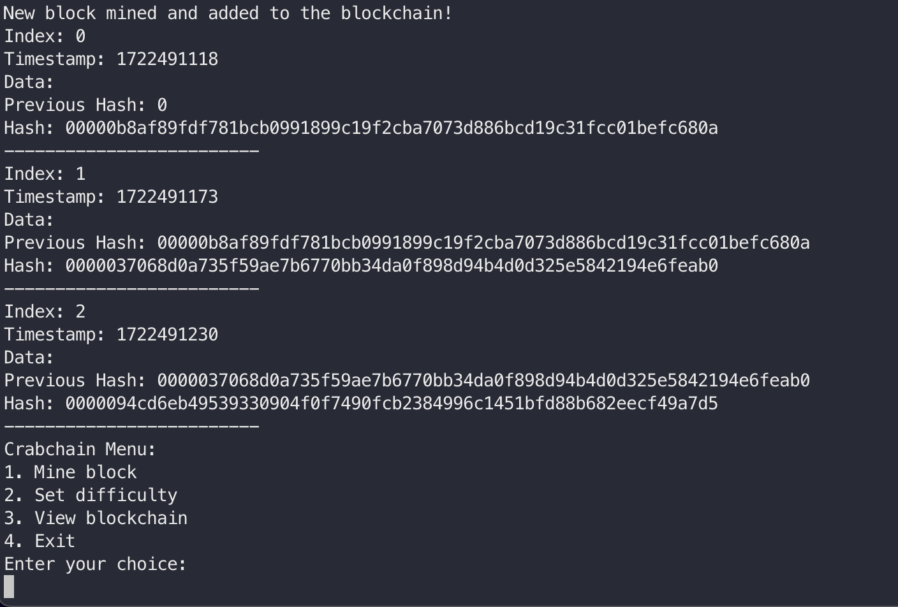

Crabchain, a crustacean themed blockchain implementation written in Rust.

## Table of Contents

- [Introduction](#introduction)
- [Features](#features)
- [Installation](#installation)
- [Usage](#usage)
- [Contributing](#contributing)
- [License](#license)

## Introduction

I built Crabchain as a way to familiarize myself with Rust. Crabchain doesn't have too many features, but it is fairly nimble and safe. It does allow for some of the most common blockchain operations such as mining with proof of work and viewing the blockchain. It also allows you to set the difficulty level of the blockchain to control the mining process to tune it for your needs.

## Features

- **Mine new blocks**: Crabchain allows you to mine new blocks and add them to the blockchain using a proof-of-work algorithm.
- **Set difficulty levels**: You can set the difficulty level of the blockchain to control the mining process.
- **View the blockchain**: Crabchain provides a way to view the blockchain and its transactions.
- **Basic blockchain data structure**: Crabchain uses a basic blockchain data structure to store blocks and transactions.
- **Blockchain validation**: Crabchain can validate the integrity of the blockchain and ensure that it follows the rules of the blockchain protocol. (WIP)

## Installation

To install Crabchain, follow these steps:

1. Clone the repository: `git clone https://github.com/your-username/crabchain.git`
2. Navigate to the project directory: `cd crabchain`
3. Build the project: `cargo build --release`

## Usage

To use Crabchain, follow these steps:

1. Run the executable: `target/release/crabchain`
2. Select an option from the menu:
   - `1` - Mine a new block
   - `2` - Set difficulty level
   - `3` - View the blockchain
   - `4` - Exit

## Planned Features

- Add GUI
- Add Validation

## Technologies Used

- Rust
- SHA256
- hex

## License

This project is licensed under the MIT License. See the [LICENSE](LICENSE) file for more details.

